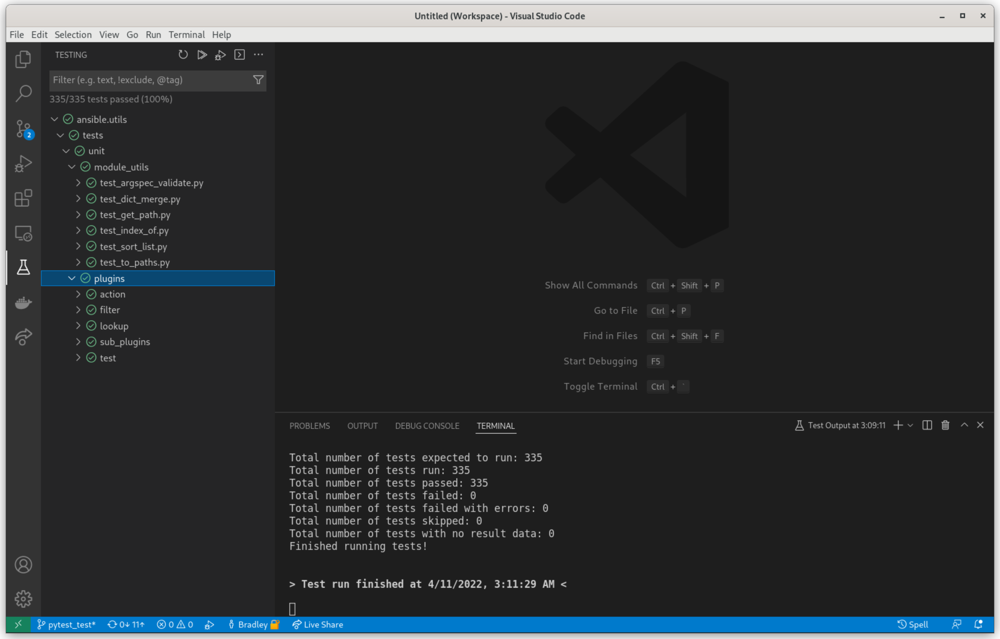
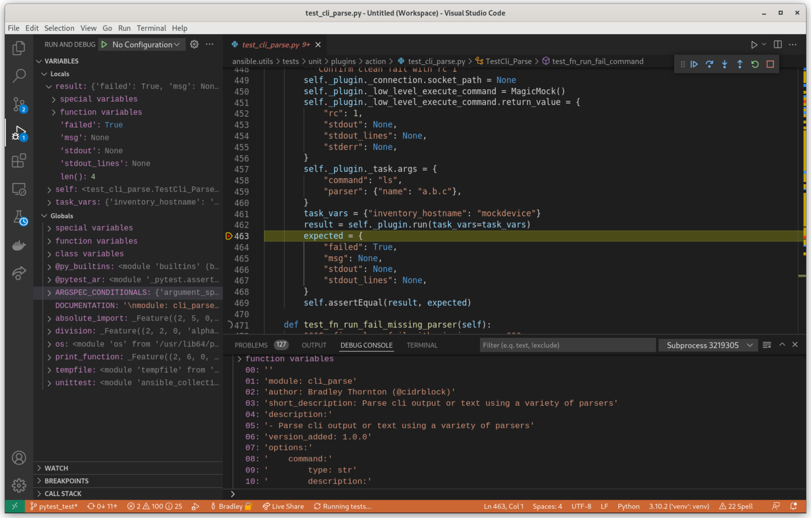

# pytest-ansible-units





A `pytest` plugin to run an ansible collections' unit tests with `pytest`.

## Description

`pytest-ansible-units` is a `pytest` plugin that allows an ansible collection's unit tests to be run with only `pytest`.  `pytest` can be used from the command line or from the IDE.

## Getting Started

### Dependencies

Installing `pytest-ansible-units` will install the following:

* `ansible-core`
* `pytest`
* `pyyaml`

`pytest-ansible-units` requires python 3.8 or greater.

### Installing

Until released on `pypi`:

```
python -m pip install git+https://github.com/cidrblock/pytest-ansible-units.git
```

* `pytest` needs to be run in the root of the collection directory, adjacent to the collection's galaxy.yml file
* Add `/collections/` to the .gitignore, since the collection's content will be linked in the `collections` directory
* Install any collections dependencies into the default user location

### Executing program

From the command line, from the collection's root directory:

```
pytest tests
```

## Help

The following may be added to the collections' `pyproject.toml` file to limit warnings and set the default path for the collection's tests

```
[tool.pytest.ini_options]
testpaths = [
    "tests",
]
filterwarnings = [
    'ignore:AnsibleCollectionFinder has already been configured',
]
```

Information from the `galaxy.yml` file is used to build the `collections` directory structure and link the contents. The `galaxy.yml` file should reflect the correct collection namespace and name.

One way to detect issues without running the tests is to run:

```
pytest --collect-only
```

The follow errors may be seen:

```
E   ModuleNotFoundError: No module named 'ansible_collections'
```

* Check the `galaxy.yml` file for an accurate namespace and name
* Ensure `pytest` is being run from the collection's root directory, adjacent to the `galaxy.yml`

```
HINT: remove __pycache__ / .pyc files and/or use a unique basename for your test file modules
```

* Ensure each test directory has an `__init__.py`


## Authors

* cidrblock

## License

This project is licensed under the GPL-v3 License - see the LICENSE file for details
